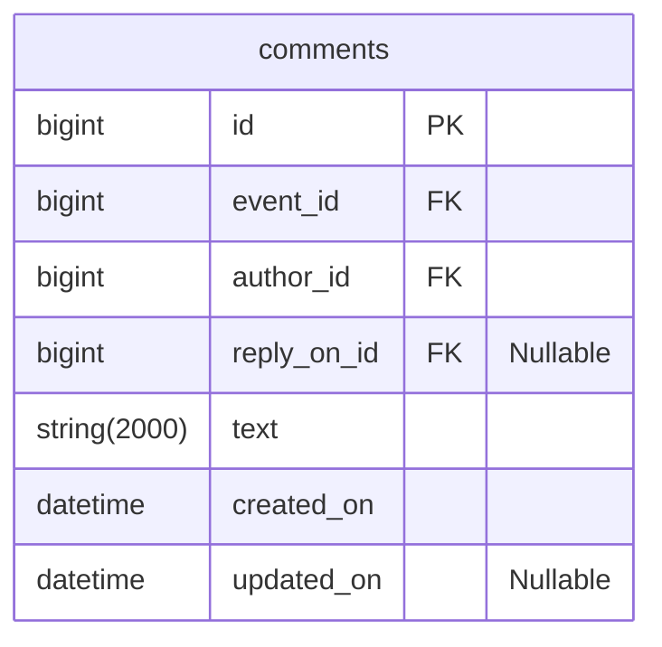

# java-explore-with-me-plus
Template repository for ExploreWithMe project.

---

## Комментарии
Комментарии реализованы на примере TripAdvisor.



### Доступные эндпоинты
---
#### Public
---

###### GET ```/events/{eventId}/comments``` - Просмотр комментариев на событии

- Событие должно быть опубликовано
- Сортировка по убвыванию даты создания сообщения

```  
Параметры:
```

- eventId - Id события, к которому нужно вернуть комментарии
- from - Количество коментариев, которые нужно пропустить для форматирования текущего набора. Default value: 0
- size - Количество коментариев в наборе. Default value: 10

```
Статусы ответов:
```

<table>
    <tr>
        <th>Описание</th>
        <th>Код ответа</th>
        <th>Тело ответа</th>
    </tr>
    <tr>
        <td>Запрос обработан успешно</td>
        <td>200 OK</td>
        <td>Collection<CommentDto></td>
    </tr>
    <tr>
        <td>Запрос составлен некорректно</td>
        <td>400 Bad Request</td>
        <td>ApiError</td>
    </tr>
    <tr>
        <td>Событие не найдено</td>
        <td>404 Not Found</td>
        <td>ApiError</td>
    </tr>
</table>

---
#### Private
---

###### GET ```/users/{userId}/comments``` - Просмотр всех комментариев пользователя

- Сортировка по убвыванию даты создания сообщения

```  
Параметры:
```

- userId - Id клиента, чьи комментарии нужно вернуть
- from - Количество коментариев, которые нужно пропустить для форматирования текущего набора. Default value: 0
- size - Количество коментариев в наборе. Default value: 10

```  
Статусы ответов:
```  

<table>
    <tr>
        <th>Описание</th>
        <th>Код ответа</th>
        <th>Тело ответа</th>
    </tr>
    <tr>
        <td>Запрос обработан успешно</td>
        <td>200 OK</td>
        <td>CommentDto</td>
    </tr>
    <tr>
        <td>Запрос составлен некорректно</td>
        <td>400 Bad Request</td>
        <td>ApiError</td>
    </tr>
    <tr>
        <td>Клиент не найден</td>
        <td>404 Not Found</td>
        <td>ApiError</td>
    </tr>
</table>


###### POST ```/users/{userId}/comments``` - Добавление комментария к событию

```  
Параметры:
```  

- userId - Id клиента, который создает комментарий

```  
Тело запроса:
```

NewCommentDto

<table>
    <tr>
        <td>event</td>
        <td>Id события, к которому создается комментарий</td>
        <td>Обязательный параметр</td>
    </tr>
    <tr>
        <td>replyOn</td>
        <td>Id комментария, на который дается ответ</td>
        <td>Необязательный параметр</td>
    </tr>
    <tr>
        <td>text</td>
        <td>Текст комментария</td>
        <td>Обязательный параметр</td>
    </tr>
</table>

```  
Статусы ответов:
```

<table>
    <tr>
        <th>Описание</th>
        <th>Код ответа</th>
        <th>Тело ответа</th>
    </tr>
    <tr>
        <td>Запрос обработан успешно</td>
        <td>201 CREATED</td>
        <td>CommentDto</td>
    </tr>
    <tr>
        <td>Запрос составлен некорректно</td>
        <td>400 Bad Request</td>
        <td>ApiError</td>
    </tr>
    <tr>
        <td>Комментарий или пользователь не найден</td>
        <td>404 Not Found</td>
        <td>ApiError</td>
    </tr>
</table>

###### PATCH ```/users/{userId}/comments/{commentId}``` - Обновление комментария

```  
Параметры:
```  

- userId - Id клиента, который создает комментарий
- commentId - Id комментария, к которому нужно оставить комментарии

```  
Тело запроса:
```

UpdateCommentDto

<table>
    <tr>
        <td>text</td>
        <td>Текст комментария</td>
        <td>Обязательный параметр</td>
    </tr>
</table>

```  
Статусы ответов:
```  

<table>
    <tr>
        <th>Описание</th>
        <th>Код ответа</th>
        <th>Тело ответа</th>
    </tr>
    <tr>
        <td>Запрос обработан успешно</td>
        <td>200 OK</td>
        <td>CommentDto</td>
    </tr>
    <tr>
        <td>Запрос составлен некорректно</td>
        <td>400 Bad Request</td>
        <td>ApiError</td>
    </tr>
    <tr>
        <td>Комментарий или пользователь не найден</td>
        <td>404 Not Found</td>
        <td>ApiError</td>
    </tr>
</table>


###### DELETE ```/users/{userId}/comments/{commentId}``` - Удаление комментария

- Удалить комментарий может только автор

```  
Параметры:
```

- commentId - Id комментария, к которому нужно оставить комментарии

```  
Статусы ответов:
```  

<table>
    <tr>
        <th>Описание</th>
        <th>Код ответа</th>
        <th>Тело ответа</th>
    </tr>
    <tr>
        <td>Запрос обработан успешно</td>
        <td>204 NO_CONTENT</td>
        <td></td>
    </tr>
    <tr>
        <td>Запрос составлен некорректно</td>
        <td>400 Bad Request</td>
        <td>ApiError</td>
    </tr>
    <tr>
        <td>Комментарий или пользователь не найден</td>
        <td>404 Not Found</td>
        <td>ApiError</td>
    </tr>
</table>


---
#### Admin
---


###### DELETE ```/admin/comments/{commentId}``` - Удаление комментария

```  
Параметры:
```

- commentId - Id комментария, к которому нужно оставить комментарии

```  
Статусы ответов:
```  

<table>
    <tr>
        <th>Описание</th>
        <th>Код ответа</th>
        <th>Тело ответа</th>
    </tr>
    <tr>
        <td>Запрос обработан успешно</td>
        <td>204 NO_CONTENT</td>
        <td></td>
    </tr>
    <tr>
        <td>Комментарий не найден</td>
        <td>404 Not Found</td>
        <td>ApiError</td>
    </tr>
</table>
